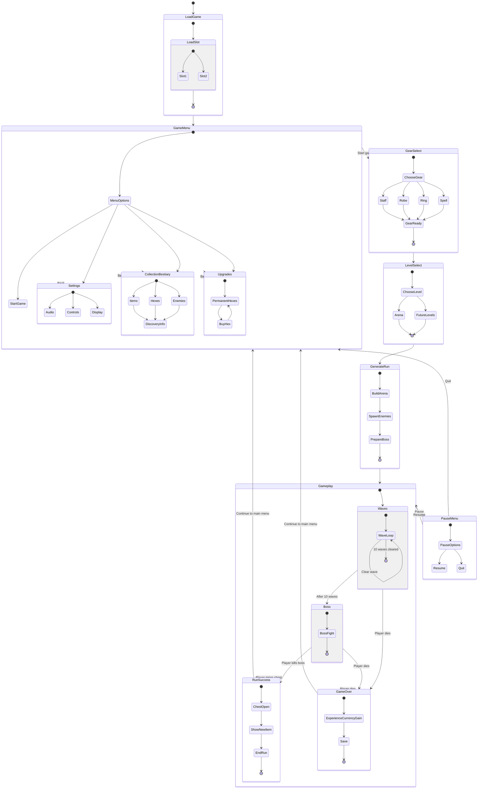

# Hexborne Game State Flow

## Overview

Hexborne is a wave-based action roguelite where the player starts from a main menu, prepares a build, enters a run, fights through enemy waves, and tries to defeat a boss. The game is built around short runs, permanent progression, item discovery, and repeatable attempts.

The player begins by loading a save file and entering the game menu. From there, they can start a new run, change settings, view discovered content in the collection and bestiary, or spend earned resources on permanent upgrades called hexes.

Before gameplay starts, the player chooses their unlocked gear. This includes a staff, robe, ring, and spell. The selected gear defines the player's build for the next run. After choosing gear, the player selects a level, then the game generates the run.

During gameplay, the player fights enemies in an open arena. The main objective is to survive and clear 10 waves. After the waves are completed, a boss encounter begins. If the player defeats the boss, the run is successful and the player receives a chest reward. The chest can contain a new random item, or convert into souls if the item is already owned.

If the player dies during the waves or boss fight, the run ends immediately in a game over state. The player still receives experience and currency based on their progress, then the game saves and returns to the main menu.

Between runs, the player can use earned currency to buy permanent hex upgrades. They can also inspect unlocked items, hexes, and enemies in the collection and bestiary. This creates the main progression loop: prepare a build, enter a run, earn rewards, upgrade the character, and attempt stronger runs.

